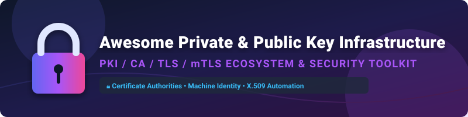

# Awesome Private & Public Key Infrastructure (PKI / CA) Ecosystem 🔐

  
  
  
  
  

## 📌 Top Private Public Key Infrastructure (PKI/CA) Ecosystem & Security Directory 🛡️

**A Curated Directory of Enterprise SaaS Platforms, Certificate Management Solutions & Open-Source Private Certificate Authorities**  
*Focused on Private Certificate Authorities (CAs), X.509 Certificate Lifecycle Management (CLM), mTLS Zero-Trust, Workload Identity & Self-Hosted Security Infrastructure.*  

---

### 💡 Overview & Category Highlights 🚀

This repository tracks notable **commercial private PKI platforms** and **open-source projects** that issue, manage, automate, and revoke X.509 certificates for internal microservices, IoT edge devices, cloud workloads, and enterprise users — enabling mTLS, code signing, SSH certificates, and secure machine-to-machine authentication without public CA dependencies.

- 🏢 **Commercial SaaS Category Leaders**: AWS Private CA, DigiCert ONE, HashiCorp Vault PKI, Venafi (CyberArk), Keyfactor Command, Sectigo SCM, AppViewX CERT+, GlobalSign Atlas, Smallstep Platform, and Entrust PKIaaS.
- ⚡ **Open-Source Champions**: `mkcert` (51k+ ⭐), `Teleport` (16.9k+ ⭐), `cert-manager` (12.4k+ ⭐), `CFSSL` (8.3k+ ⭐), `step-ca` / Smallstep (6.7k+ ⭐), `Vault` (31k+ ⭐), `OpenSSL` (26k+ ⭐), `SPIRE` (1.8k+ ⭐), and `EJBCA`.

---

## 📑 Table of Contents 🔍

- [☁️ SaaS & Hosted Enterprise Platforms](#%EF%B8%8F-saas--hosted-enterprise-platforms)
- [🔓 Open-Source GitHub Projects](#-open-source-github-projects)
  - [🛡️ Certificate Authorities & Core PKI](#%EF%B8%8F-certificate-authorities--core-pki)
  - [⚙️ Certificate Automation, Kubernetes & Access Control](#%EF%B8%8F-certificate-automation-kubernetes--access-control)
  - [🧰 Cryptographic Libraries, CLI Tools & Dev Utilities](#-cryptographic-libraries-cli-tools--dev-utilities)
  - [🌐 Additional ACME Clients & TLS Engines](#-additional-acme-clients--tls-engines)
- [🤝 How to Contribute](#-how-to-contribute)
- [⚠️ Security Disclaimer](#%EF%B8%8F-security-disclaimer)
- [📊 Star History](#-star-history)
- [💖 Support & Sponsorship](#-support--sponsorship)

---

## ☁️ SaaS & Hosted Enterprise Platforms 🏢

> 📈 **Sector Market Size & Dynamics**: The global Certificate Lifecycle Management (CLM) and Private PKI market is estimated at **$1.8B to $2.5B+ (2026)** with a compound annual growth rate (CAGR) of **~14.5%**, driven by zero-trust architectures, short-lived certificate trends, and quantum-safe crypto readiness.  
> 🏛️ **Market Structure**: The sector is **moderately fragmented**. High-end enterprise CLM & hardware-backed PKI are led by established security giants (DigiCert, CyberArk/Venafi, Keyfactor, Sectigo), while cloud-native dynamic issuance is dominated by hyperscalers (AWS Private CA, HashiCorp/IBM HCP Vault).

*Platforms are sorted below by estimated company scale / market valuation in descending order:*

| Platform | Enterprise Scale / Valuation | Pricing (Starting Tier) | Free Tier Limit / Trial | Key Focus & Description |
| :--- | :--- | :--- | :--- | :--- |
| **[AWS Private CA](https://aws.amazon.com/private-ca/)** ☁️ | **~$1.8 Trillion** (Amazon Market Cap) | $50/mo per CA (Short-lived mode) or $400/mo per CA (General-purpose mode) + per-cert fees | 30-day free trial (covers CA operation fee for 1st CA per account/region; cert issuance billed) | AWS managed private CA for internal services, integrated with ACM, IAM, and CloudWatch. |
| **[HashiCorp Vault PKI](https://www.hashicorp.com/products/vault)** 🔑 | **~$6.4 Billion** (Acquired by IBM / Market Cap) | $0.62/hour (~$450/month) for Dev cluster; $1.58/hour for Essentials tier | $500 HCP trial credit (or open-source Community Edition free self-hosted) | Managed HCP Vault secrets engine for dynamic X.509 certificate issuance and automated renewal. |
| **[DigiCert ONE](https://www.digicert.com/)** 🛡️ | **~$3.5 Billion+** (Private / Clearlake Capital) | Enterprise contract-based (Custom annual licensing per unit/managed cert) | No self-service free trial; custom demo & sandbox trial tenant available upon sales request | Unified enterprise PKI, certificate lifecycle management, and IoT device identity platform. |
| **[Venafi (CyberArk)](https://venafi.com/)** 🦅 | **~$2.5 Billion** (Acquired by CyberArk/Palo Alto) | Enterprise contract pricing (Custom annual subscription based on managed keys/certs) | Custom proof-of-concept / demo tenant available upon enterprise sales request | Machine identity management and enterprise certificate lifecycle automation at scale. |
| **[Keyfactor Command](https://www.keyfactor.com/)** 🔐 | **~$1.3 Billion+** (Private Unicorn / Insight Partners) | Enterprise annual contract-based (~$50k+ base quote); usage-based on AWS/Azure | 30-day test drive / free trial (available via cloud marketplaces or sales request) | Machine identity management, PKI automation, and enterprise code signing. |
| **[Sectigo SCM](https://sectigo.com/)** 📜 | **~$1.0 Billion+** (Private / GI Partners) | Custom enterprise quote; SCM Pro plans scale by domain count | 30-day free trial (SCM Pro; includes 5 free 90-day DV certificates, no credit card required) | Automated certificate lifecycle management for private and public certificates across enterprise networks. |
| **[GlobalSign Atlas](https://www.globalsign.com/)** 🌐 | **~$600 Million+** (GMO GlobalSign Parent Cap) | Enterprise contract pricing (Volume-based annual subscription) | No public free trial; sandbox / API developer test environment available upon sales request | Cloud-native high-volume private CA and certificate management platform. |
| **[AppViewX CERT+](https://www.appviewx.com/)** ⚡ | **~$350 Million+** (Private / Premji Invest) | Enterprise contract pricing; marketplace subscriptions based on node/cert tiers | Custom demo / cloud trial tenant available upon request via AWS Marketplace & website | Certificate lifecycle automation for enterprise discovery, renewal, and compliance. |
| **[Entrust PKIaaS](https://www.entrust.com/)** 🏛️ | **~$300 Million+** (Private Enterprise Revenue) | ~$6,000–$7,200/year base instance bundle + unit volume costs | Custom demo & test CA sandbox environment available upon sales request | Managed turnkey private CA and certificate lifecycle as a service. |
| **[Smallstep](https://smallstep.com/)** 🚀 | **~$100 Million+** (Private Venture Backed) | Custom enterprise contract for managed platform | 30-day free trial for commercial platform (or open-source `step-ca` free self-hosted) | Hosted modern PKI platform with ACME, OIDC, and short-lived certificate support. |

---

## 🔓 Open-Source GitHub Projects 🐙

Open-source projects below are categorized and **sorted by GitHub_Stars_Count in descending order** within each sub-category.

### 🛡️ Certificate Authorities & Core PKI

-  **[Vault PKI](https://github.com/hashicorp/vault)** — **31,000+ ⭐** • BSL licensed. Vault's PKI secrets engine enables dynamic X.509 certificate issuance and revocation without manual CA overhead.
-  **[CFSSL](https://github.com/cloudflare/cfssl)** — **8,300+ ⭐** • BSD-2-Clause licensed. Cloudflare's PKI and TLS toolkit for certificate signing, verification, and bundling.
-  **[step-ca / Smallstep](https://github.com/smallstep/certificates)** — **6,700+ ⭐** • Apache-2.0 licensed. The de facto modern open-source ACME certificate authority for short-lived TLS & SSH certificates.
-  **[Boulder](https://github.com/letsencrypt/boulder)** — **3,600+ ⭐** • MPL-2.0 licensed. Let's Encrypt's ACME CA core engine implementation written in Go.
-  **[OpenBao PKI](https://github.com/openbao/openbao)** — **3,500+ ⭐** • MPL-2.0 licensed. Linux Foundation community fork of Vault providing open-source PKI secret management.
-  **[XCA](https://github.com/chris2511/xca)** — **1,200+ ⭐** • BSD-3-Clause licensed. Graphical X Certificate and Key management application for desktop PKI handling.
-  **[EJBCA Community](https://github.com/Keyfactor/ejbca-ce)** — **550+ ⭐** • LGPL-2.1 licensed. Industrial-grade open-source CA supporting OCSP, SCEP, ACME, EST, and CRLs.
-  **[OpenXPKI](https://github.com/openxpki/openxpki)** — **350+ ⭐** • Apache-2.0 licensed. Enterprise PKI suite featuring a flexible workflow management engine.
-  **[Dogtag PKI](https://github.com/dogtagpki/pki)** — **220+ ⭐** • GPL-2.0 licensed. Red Hat's full-featured enterprise certificate system.

---

### ⚙️ Certificate Automation, Kubernetes & Access Control

-  **[Teleport](https://github.com/gravitational/teleport)** — **16,900+ ⭐** • AGPL-3.0 licensed. Identity-aware, certificate-based infrastructure access proxy for SSH, Kubernetes, databases, and web apps.
-  **[cert-manager](https://github.com/cert-manager/cert-manager)** — **12,400+ ⭐** • Apache-2.0 licensed. Cloud Native Computing Foundation (CNCF) standard for automating TLS certificate issuance and renewal in Kubernetes.
-  **[SPIFFE / SPIRE](https://github.com/spiffe/spire)** — **1,800+ ⭐** • Apache-2.0 licensed. Zero-trust workload identity provider delivering automated X.509 SVID certificate issuing and rotation.

---

### 🧰 Cryptographic Libraries, CLI Tools & Dev Utilities

-  **[mkcert](https://github.com/FiloSottile/mkcert)** — **51,000+ ⭐** • BSD-3-Clause licensed. Zero-configuration tool for generating locally-trusted development certificates with custom local CA.
-  **[OpenSSL](https://github.com/openssl/openssl)** — **26,000+ ⭐** • Apache-2.0 licensed. The foundational industry standard cryptographic library and TLS toolkit.
-  **[BoringSSL](https://github.com/google/boringssl)** — **6,300+ ⭐** • ISC licensed. Google's security-focused fork of OpenSSL used in Chrome, Android, and WebRTC.
-  **[easy-rsa](https://github.com/OpenVPN/easy-rsa)** — **3,100+ ⭐** • GPL-2.0 licensed. Simple script-based tool to manage local RSA & ECC CAs, primarily used with OpenVPN.
-  **[certstrap](https://github.com/square/certstrap)** — **2,300+ ⭐** • Apache-2.0 licensed. Square's lightweight bootstrap tool for managing Certificate Authorities and certificates in Go.
-  **[LibreSSL](https://github.com/libressl/portable)** — **2,200+ ⭐** • ISC licensed. OpenBSD's refactored fork of OpenSSL emphasizing modern security standards.

---

### 🌐 Additional ACME Clients & TLS Engines

-  **[acme.sh](https://github.com/acmesh-official/acme.sh)** — **38,000+ ⭐** • GPL-3.0 licensed. Pure Shell ACME protocol client supporting automated zero-config certificate issuance across 100+ DNS providers.
-  **[Certbot](https://github.com/certbot/certbot)** — **31,500+ ⭐** • Apache-2.0 licensed. EFF's popular automated ACME client for provisioning Let's Encrypt certificates on web servers.
-  **[Lego](https://github.com/go-acme/lego)** — **7,100+ ⭐** • MIT licensed. Pure Go ACME client library and CLI supporting Let's Encrypt and custom ACME CAs.

---

## 🤝 How to Contribute 🛠️

Contributions are welcome! Help us expand and maintain this list.

1. Fork the repository.
2. Follow the table/listing structure above.
3. Keep descriptions factual, unbiased, and link to official project homepages / GitHub repositories.
4. Open a Pull Request with a short summary of changes.

> Explore curated lists of awesome lists on [Awesome-Awesome-Awesome](https://github.com/ishandutta2007/Awesome-Awesome-Awesome)!

---

## ⚠️ Security Disclaimer 🔐

- This list is **community-curated** for educational and architectural evaluation purposes.
- Private PKI root keys govern identity and decryption across internal systems. Compromise of a Root CA key allows full domain impersonation. Ensure proper Hardware Security Module (HSM) backing and offline key storage for production CAs.
- Always review repository licenses (e.g. Apache-2.0, LGPL, BSL) before incorporating tools into enterprise environments.

---

## 📊 Star History

---

## 💖 Support & Sponsorship 🙏

Thank you for visiting and supporting the **Awesome Private & Public Key Infrastructure** repository! If you find this directory valuable for your security team, platform architecture, or devops workflows:

- ⭐ **Star** this repository to help others discover it!
- 🔀 **Fork** it to keep your own reference copy or contribute new tools.
- 📢 **Share** it with your fellow security engineers and platform architects.

☕ **Want to buy me a coffee?** Support ongoing maintenance and curation via the [GitHub Sponsors Dashboard](https://github.com/sponsors/ishandutta2007).

---

  <b>Made with ❤️ for security engineers, platform teams, and organizations seeking private PKI sovereignty.</b>

